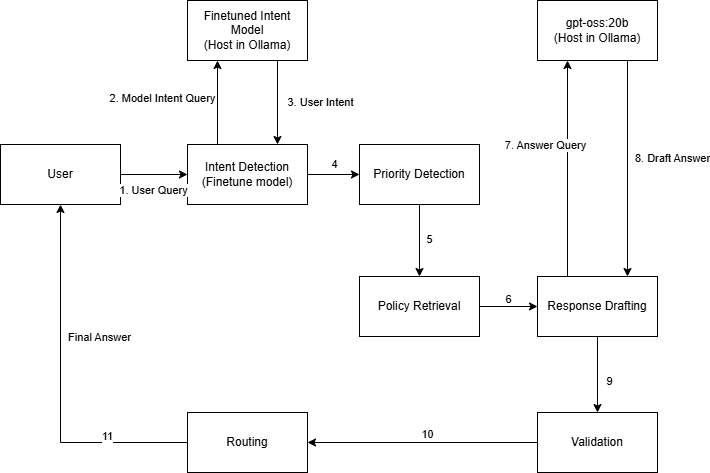

# A BANKING AI-AGENTS PROJECT

## Project Objective
The primary goal of this system is to provide **automated, policy-compliant, and risk-aware support** for banking customers. It aims to reduce wait times and operational overhead by handling routine inquiries autonomously while ensuring that high-stakes or complex issues are identified and escalated to human professionals immediately.

---

## System Workflow
The agent operates through a sequential, multi-node architecture to ensure every response is grounded in reality and bank policy.

1.  **Intent Detection Node**: Classify the raw input message using a Finetuned Banking Intent to categorize the request.

2.  **Priority or Risk Detection Node**: Evaluates the urgency and potential risk of the query. It classifies the issue as **Low, Medium, or High** priority, triggering faster paths for high-risk items like stolen cards.

3.  **Policy Retrieval Node**: Uses a simple FAQ entries, official bank policy snippets, or internal support guidelines relevant to the detected intent.

4.  **Response Drafting Node**: The LLM synthesizes the customer intent and the retrieved policy data to generate a coherent, professional, and helpful draft reply.

5.  **Validation Node**: A critical "sanity check" layer. This node audits the draft against the retrieved policy to ensure no misinformation was hallucinated and that all necessary security disclosures are present.

6.  **Escalation Node**: Based on the risk level and the complexity of the validation results, this node decides if the case is resolved or if it requires a **Human-in-the-loop** handoff.



---

## Installation and Setup

### 1. Hosting model server on Google Colab

Run the file: `app/model_server/Ollama-Pinggy.ipynb` for turn on the model server. It will generate the Ollama Tunnel URL which is using Pinggy (expired in 60 mins)

### 2. Local Agent Setup
1.  **Clone the repository**:
    ```bash
    git clone https://github.com/nganbee/banking-agentic.git
    cd banking-agentic
    ```

2. **Create a virtual environment**:
    ```bash
    python -m venv .venv
    source venv/bin/activate  # On Windows: venv\Scripts\activate
    ```

3.  **Install dependencies**:
    ```bash
    pip install -r requirements.txt
    ```

4.  **Environment Setup**:
    Update your `.env` file with the tunnel URL from Colab:
    ```env
    OLLAMA_BASE_URL=ollama_url
    ```
### 3. Running the Project
To start the agentic API, run:
```bash
python run.py
```

---

## Video Demo
You can view a comprehensive walkthrough of the system, including the node-by-node decision-making process, at the link below:  

[Watch video demo here](link_video)
